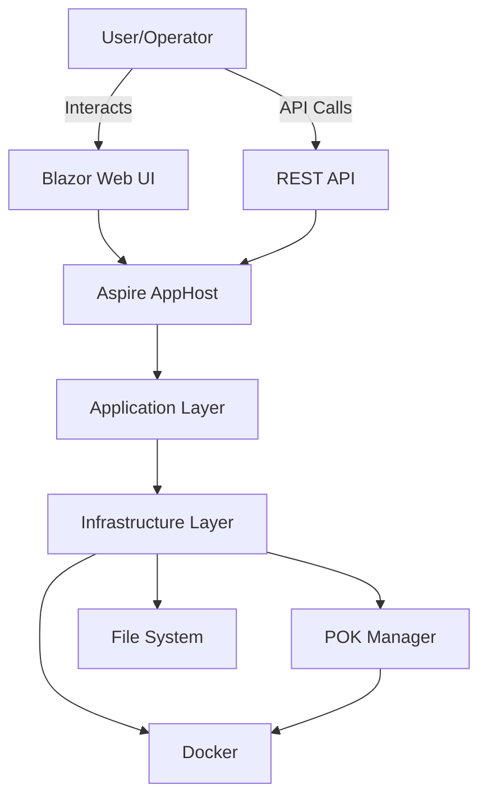
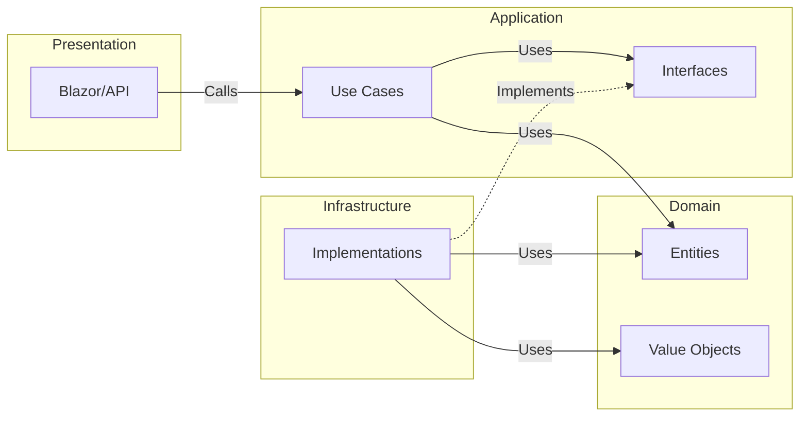
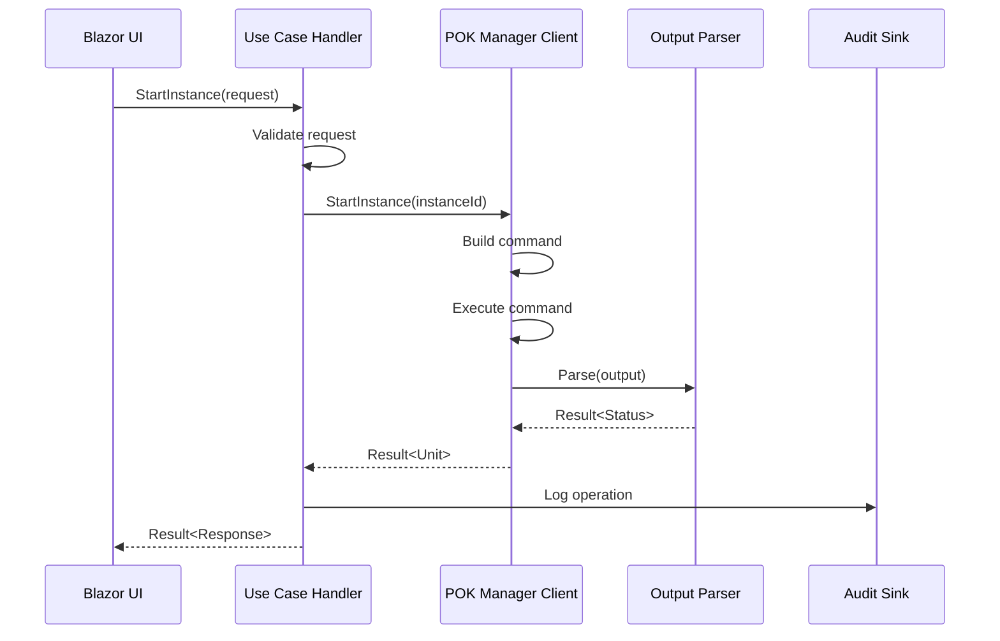

# Architecture Documentation

## Overview

PokManagerApi is built using **Clean Architecture** principles, emphasizing separation of concerns, testability, and maintainability. The architecture ensures that business logic remains independent of external frameworks, databases, and UI concerns.

## Table of Contents

- [Architectural Principles](#architectural-principles)
- [Layer Descriptions](#layer-descriptions)
- [Dependency Rules](#dependency-rules)
- [Design Patterns](#design-patterns)
- [Testing Strategy](#testing-strategy)
- [Architecture Diagrams](#architecture-diagrams)
- [Key Abstractions](#key-abstractions)

## Architectural Principles

### 1. Clean Architecture

The system follows Uncle Bob's Clean Architecture, organizing code into concentric layers where:

- **Inner layers** contain business logic and have no knowledge of outer layers
- **Outer layers** depend on inner layers, never the reverse
- **Dependency Inversion** - High-level modules don't depend on low-level modules

### 2. SOLID Principles

- **Single Responsibility** - Each class has one reason to change
- **Open/Closed** - Open for extension, closed for modification
- **Liskov Substitution** - Subtypes must be substitutable for their base types
- **Interface Segregation** - Many specific interfaces are better than one general-purpose interface
- **Dependency Inversion** - Depend on abstractions, not concretions

### 3. Test-Driven Development (TDD)

- Tests written **before** implementation
- TinyBDD framework for behavior-driven tests
- 904 comprehensive tests across all layers
- Fast test execution (< 2 seconds total)

### 4. Configuration-Driven

- No hardcoded paths or instance names
- All runtime assumptions are configurable
- Validated configuration at startup
- Sane defaults with override capability

## Layer Descriptions

### Domain Layer (Core)

**Location**: `src/Core/PokManager.Domain`

**Purpose**: Contains the core business logic and domain models with no external dependencies.

**Key Components**:

```
PokManager.Domain/
├── Common/
│   ├── Result.cs                 # Result<T> monad for error handling
│   └── Unit.cs                   # Unit type for void operations
│
├── Entities/
│   ├── Instance.cs               # Server instance entity
│   ├── Backup.cs                 # Backup entity
│   └── Operation.cs              # Operation tracking entity
│
├── ValueObjects/
│   ├── InstanceId.cs             # Instance identifier
│   ├── BackupId.cs               # Backup identifier
│   └── OperationStatus.cs        # Operation status value object
│
└── Enumerations/
    ├── InstanceState.cs          # Instance states (Running, Stopped, etc.)
    ├── ProcessHealth.cs          # Health status
    └── CompressionFormat.cs      # Backup compression formats
```

**Characteristics**:
- No external dependencies (pure .NET 9)
- Immutable value objects
- Domain invariants enforced
- Business rules encoded in domain entities

**Test Coverage**: 119 tests

### Application Layer

**Location**: `src/Core/PokManager.Application`

**Purpose**: Contains use cases, business rules, and application-specific interfaces.

**Key Components**:

```
PokManager.Application/
├── UseCases/
│   ├── Instances/
│   │   ├── StartInstance/
│   │   │   ├── StartInstanceHandler.cs
│   │   │   ├── StartInstanceRequest.cs
│   │   │   └── StartInstanceResponse.cs
│   │   ├── StopInstance/
│   │   ├── RestartInstance/
│   │   └── ListInstances/
│   │
│   ├── Backups/
│   │   ├── CreateBackup/
│   │   ├── RestoreBackup/
│   │   └── ListBackups/
│   │
│   └── Configuration/
│       ├── GetConfiguration/
│       └── UpdateConfiguration/
│
├── Interfaces/
│   ├── IPokManagerClient.cs      # POK Manager operations
│   ├── IBackupStore.cs           # Backup storage
│   ├── IOperationAuditSink.cs    # Audit logging
│   └── IClock.cs                 # Time abstraction
│
├── Models/
│   ├── InstanceStatus.cs         # Instance status DTO
│   ├── BackupInfo.cs             # Backup information DTO
│   └── OperationResult.cs        # Operation result DTO
│
└── Validation/
    ├── StartInstanceValidator.cs
    └── RestoreBackupValidator.cs
```

**Characteristics**:
- Depends only on Domain layer
- Defines interfaces (ports) for infrastructure
- Request/Response DTOs for all use cases
- FluentValidation for input validation
- No framework-specific code

**Test Coverage**: 390 tests

### Infrastructure Layer

**Location**: `src/Infrastructure/`

**Purpose**: Implements external concerns and application interfaces.

#### PokManager.Infrastructure

**Location**: `src/Infrastructure/PokManager.Infrastructure`

**Key Components**:

```
PokManager.Infrastructure/
├── Configuration/
│   ├── PokManagerOptions.cs
│   └── BackupOptions.cs
│
├── Services/
│   ├── FileSystemService.cs
│   └── YamlConfigurationService.cs
│
└── Abstractions/
    ├── ICommandExecutor.cs
    └── IProcessRunner.cs
```

**Characteristics**:
- Base infrastructure services
- YAML configuration parsing
- File system abstractions
- Shared infrastructure utilities

#### PokManager.Infrastructure.PokManager

**Location**: `src/Infrastructure/PokManager.Infrastructure.PokManager`

**Key Components**:

```
PokManager.Infrastructure.PokManager/
├── PokManager/
│   ├── PokManagerClient.cs           # IPokManagerClient implementation
│   │
│   ├── CommandBuilders/
│   │   ├── StartCommandBuilder.cs
│   │   ├── StopCommandBuilder.cs
│   │   ├── BackupCommandBuilder.cs
│   │   └── RestoreCommandBuilder.cs
│   │
│   ├── Parsers/
│   │   ├── StatusOutputParser.cs     # Status parsing
│   │   ├── DetailsOutputParser.cs    # Configuration parsing
│   │   ├── ListInstancesParser.cs    # Instance list parsing
│   │   ├── BackupListParser.cs       # Backup list parsing
│   │   └── ErrorOutputParser.cs      # Error categorization
│   │
│   └── Executors/
│       └── BashCommandExecutor.cs    # Command execution
│
└── Docker/
    └── DockerCommandBuilder.cs
```

**Characteristics**:
- POK Manager CLI integration
- Command builders for type-safe operations
- Output parsers (5 parsers, 105 tests)
- Bash command execution
- Result<T> for all operations

#### PokManager.Infrastructure.Docker

**Location**: `src/Infrastructure/PokManager.Infrastructure.Docker`

**Key Components**:
- Docker container operations
- Container health checks
- Volume management

**Test Coverage**: 394 tests (Infrastructure total)

### Presentation Layer

**Location**: `src/Presentation/`

**Purpose**: User interfaces and API endpoints.

#### PokManager.Web (Blazor)

**Location**: `src/Presentation/PokManager.Web`

**Key Components**:

```
PokManager.Web/
├── Components/
│   ├── Pages/
│   │   ├── Dashboard.razor
│   │   ├── Instances.razor
│   │   └── Backups.razor
│   │
│   ├── Shared/
│   │   ├── InstanceCard.razor
│   │   ├── BackupList.razor
│   │   └── OperationStatus.razor
│   │
│   └── Layout/
│       ├── MainLayout.razor
│       └── NavMenu.razor
│
└── Services/
    └── InstanceStateService.cs
```

**Characteristics**:
- Blazor Server/WebAssembly components
- Calls Application layer only
- No direct infrastructure access
- Component-based architecture

#### PokManager.ApiService (REST API)

**Location**: `src/Presentation/PokManager.ApiService`

**Key Components**:

```
PokManager.ApiService/
├── Controllers/
│   ├── InstancesController.cs
│   ├── BackupsController.cs
│   └── ConfigurationController.cs
│
└── Middleware/
    ├── ExceptionHandlingMiddleware.cs
    └── AuditLoggingMiddleware.cs
```

**Characteristics**:
- RESTful API design
- OpenAPI/Swagger documentation
- Minimal API endpoints
- Calls Application layer only

**Test Coverage**: 1 test (Web total)

### Hosting Layer

**Location**: `src/Hosting/`

**Purpose**: Application orchestration and service configuration.

#### PokManager.AppHost (Aspire)

**Location**: `src/Hosting/PokManager.AppHost`

**Purpose**: .NET Aspire orchestration for cloud-native deployment

**Characteristics**:
- Service discovery
- Health checks
- Distributed tracing
- Metrics collection

#### PokManager.ServiceDefaults

**Location**: `src/Hosting/PokManager.ServiceDefaults`

**Purpose**: Shared service configurations

**Characteristics**:
- Common service registrations
- Logging configuration
- Resilience policies

## Dependency Rules

### The Dependency Rule

**Source code dependencies must point inward only.**

```
┌─────────────────────────────────────────────────┐
│           Presentation Layer (Web, API)         │ ─┐
└────────────────┬────────────────────────────────┘  │
                 │ Depends on ↓                       │
┌────────────────▼────────────────────────────────┐  │
│        Infrastructure Layer (External)          │  │
│     (PokManager, Docker, File System)           │  │ Flow of Control
└────────────────┬────────────────────────────────┘  │
                 │ Depends on ↓                       │
┌────────────────▼────────────────────────────────┐  │
│         Application Layer (Use Cases)           │  │
│     (Business Rules, Interfaces/Ports)          │  │
└────────────────┬────────────────────────────────┘  │
                 │ Depends on ↓                       │
┌────────────────▼────────────────────────────────┐  │
│          Domain Layer (Core Logic)              │  │
│     (Entities, Value Objects, No Deps)          │ ─┘
└──────────────────────────────────────────────────┘
```

### What Can Each Layer Access?

**Domain** (innermost)
- ✅ .NET standard library only
- ❌ No external dependencies
- ❌ No knowledge of Application, Infrastructure, or Presentation

**Application**
- ✅ Domain layer
- ✅ Microsoft.Extensions.DependencyInjection.Abstractions
- ✅ FluentValidation
- ❌ No knowledge of Infrastructure or Presentation

**Infrastructure**
- ✅ Domain layer
- ✅ Application layer (implements interfaces)
- ✅ External libraries (YamlDotNet, Docker SDK, etc.)
- ❌ No knowledge of Presentation

**Presentation**
- ✅ Application layer (calls use cases)
- ✅ Web frameworks (Blazor, ASP.NET Core)
- ❌ Should not call Infrastructure directly

## Design Patterns

### 1. Result<T> Monad

**Purpose**: Type-safe error handling without exceptions

**Location**: `PokManager.Domain.Common.Result<T>`

**Usage**:
```csharp
public Result<InstanceStatus> GetStatus(string instanceId)
{
    if (string.IsNullOrEmpty(instanceId))
        return Result.Failure<InstanceStatus>("Instance ID is required");

    var status = FetchStatus(instanceId);
    return status != null
        ? Result<InstanceStatus>.Success(status)
        : Result.Failure<InstanceStatus>("Instance not found");
}
```

**Benefits**:
- Explicit success/failure states
- No exceptions for flow control
- Type-safe error handling
- Forces error handling at call sites

### 2. Repository Pattern

**Purpose**: Abstract data access

**Interfaces**: `IBackupStore`, `IConfigurationRepository`

**Benefits**:
- Testable data access
- Swappable implementations
- Clear data access boundaries

### 3. Command Pattern

**Purpose**: Encapsulate operations as objects

**Implementation**: Command builders for POK Manager operations

```csharp
public interface ICommandBuilder
{
    string Build();
}

public class StartCommandBuilder : ICommandBuilder
{
    private readonly string _instanceId;

    public StartCommandBuilder(string instanceId)
    {
        _instanceId = instanceId;
    }

    public string Build() => $"pokmanager start {_instanceId}";
}
```

**Benefits**:
- Type-safe command construction
- Testable command generation
- Reusable command logic

### 4. Strategy Pattern

**Purpose**: Interchangeable algorithms

**Implementation**: Output parsers

```csharp
public interface IPokManagerOutputParser<T>
{
    Result<T> Parse(string output);
}

public class StatusOutputParser : IPokManagerOutputParser<InstanceStatus>
{
    public Result<InstanceStatus> Parse(string output) { /* ... */ }
}
```

**Benefits**:
- Pluggable parsing strategies
- Easy to add new parsers
- Testable in isolation

### 5. Decorator Pattern

**Purpose**: Add behavior without modifying classes

**Implementation**: Operation locking, audit logging

**Benefits**:
- Cross-cutting concerns
- Composable behaviors
- Maintains single responsibility

### 6. Facade Pattern

**Purpose**: Simplify complex subsystems

**Implementation**: `IPokManagerClient` facade over command builders and parsers

**Benefits**:
- Simple API for complex operations
- Hides implementation details
- Easier to test

## Testing Strategy

### Test Pyramid

```
        ╱╲
       ╱E2E╲           Few (planned)
      ╱─────╲
     ╱Integration╲     Some (integration tests)
    ╱──────────╲
   ╱    Unit    ╲      Many (904 tests)
  ╱──────────────╲
```

### Test Layers

#### 1. Domain Tests (119 tests)

**Focus**: Domain logic, invariants, value objects

**Framework**: TinyBDD + xUnit

**Example**:
```csharp
public class When_creating_a_result : Feature
{
    [Fact]
    public void Should_be_successful_when_value_provided()
    {
        // Arrange & Act
        var result = Result<int>.Success(42);

        // Assert
        result.IsSuccess.Should().BeTrue();
        result.Value.Should().Be(42);
    }
}
```

**Coverage**: 100% of domain logic

#### 2. Application Tests (390 tests)

**Focus**: Use cases, business rules, validation

**Framework**: TinyBDD + xUnit + NSubstitute

**Example**:
```csharp
public class When_starting_an_instance : Feature
{
    [Fact]
    public void Should_return_success_when_instance_exists()
    {
        // Arrange
        var mockClient = Substitute.For<IPokManagerClient>();
        mockClient.StartInstance("server1")
            .Returns(Result.Success(Unit.Default));

        var handler = new StartInstanceHandler(mockClient);

        // Act
        var result = await handler.Handle(
            new StartInstanceRequest("server1"));

        // Assert
        result.IsSuccess.Should().BeTrue();
    }
}
```

**Coverage**: All use cases and business rules

#### 3. Infrastructure Tests (394 tests)

**Focus**: External integrations, parsers, command execution

**Framework**: TinyBDD + xUnit + NSubstitute

**Example**:
```csharp
public class When_parsing_status_output : Feature
{
    [Fact]
    public void Should_parse_running_instance()
    {
        // Arrange
        var parser = new StatusOutputParser();
        var output = "Instance: Server1, State: Running, Container: abc123, Health: Healthy";

        // Act
        var result = parser.Parse(output);

        // Assert
        result.IsSuccess.Should().BeTrue();
        result.Value.InstanceId.Should().Be("Server1");
        result.Value.State.Should().Be(InstanceState.Running);
    }
}
```

**Coverage**: 105 parser tests, command builder tests, executor tests

#### 4. Presentation Tests (1 test)

**Focus**: Blazor components, API controllers

**Framework**: bUnit + xUnit

**Coverage**: Basic component rendering (expanding)

### Test Principles

1. **Fast** - All 904 tests run in < 2 seconds
2. **Isolated** - No dependencies on external services
3. **Deterministic** - Same input = same output
4. **Readable** - Given-When-Then structure
5. **Comprehensive** - Happy path + edge cases + error cases

### TDD Workflow

```
┌─────────────────────┐
│  1. Write Test      │ (Red)
└──────────┬──────────┘
           │
┌──────────▼──────────┐
│  2. Make It Pass    │ (Green)
└──────────┬──────────┘
           │
┌──────────▼──────────┐
│  3. Refactor        │ (Refactor)
└──────────┬──────────┘
           │
           └─────────────┐
                         │
           ┌─────────────▼┐
           │ Repeat       │
           └──────────────┘
```

## Architecture Diagrams

### System Context Diagram



### Layer Interaction Diagram



### Use Case Flow Diagram



## Key Abstractions

### IPokManagerClient

**Purpose**: Primary abstraction for POK Manager operations

```csharp
public interface IPokManagerClient
{
    Task<Result<IReadOnlyList<string>>> ListInstancesAsync(CancellationToken cancellationToken = default);
    Task<Result<InstanceStatus>> GetStatusAsync(string instanceId, CancellationToken cancellationToken = default);
    Task<Result<Unit>> StartInstanceAsync(string instanceId, CancellationToken cancellationToken = default);
    Task<Result<Unit>> StopInstanceAsync(string instanceId, CancellationToken cancellationToken = default);
    Task<Result<Unit>> RestartInstanceAsync(string instanceId, CancellationToken cancellationToken = default);
    Task<Result<IReadOnlyList<BackupInfo>>> ListBackupsAsync(string instanceId, CancellationToken cancellationToken = default);
    Task<Result<Unit>> CreateBackupAsync(string instanceId, CancellationToken cancellationToken = default);
    Task<Result<Unit>> RestoreBackupAsync(string instanceId, string backupId, CancellationToken cancellationToken = default);
}
```

### IOperationAuditSink

**Purpose**: Audit trail for all operations

```csharp
public interface IOperationAuditSink
{
    Task LogOperationAsync(OperationAuditEvent auditEvent);
}

public record OperationAuditEvent(
    string CorrelationId,
    string User,
    string Operation,
    string InstanceId,
    DateTimeOffset Timestamp,
    bool Success,
    string? ErrorMessage = null
);
```

### IClock

**Purpose**: Time abstraction for testability

```csharp
public interface IClock
{
    DateTimeOffset UtcNow { get; }
}
```

## Best Practices

### 1. Always Use Result<T>

```csharp
// ✅ Good
public Result<User> GetUser(int id) { /* ... */ }

// ❌ Bad
public User GetUser(int id) // throws exception
```

### 2. Keep Domain Pure

```csharp
// ✅ Good - Domain entity
public class Instance
{
    public InstanceId Id { get; }
    public InstanceState State { get; private set; }

    public Result<Unit> Start()
    {
        if (State == InstanceState.Running)
            return Result.Failure<Unit>("Instance already running");

        State = InstanceState.Starting;
        return Result.Success(Unit.Default);
    }
}

// ❌ Bad - Infrastructure in domain
public class Instance
{
    public void Start()
    {
        var client = new HttpClient(); // ❌ Infrastructure!
        // ...
    }
}
```

### 3. Use Dependency Injection

```csharp
// ✅ Good
public class StartInstanceHandler
{
    private readonly IPokManagerClient _client;
    private readonly IOperationAuditSink _auditSink;

    public StartInstanceHandler(
        IPokManagerClient client,
        IOperationAuditSink auditSink)
    {
        _client = client;
        _auditSink = auditSink;
    }
}

// ❌ Bad
public class StartInstanceHandler
{
    private readonly IPokManagerClient _client = new PokManagerClient(); // ❌
}
```

### 4. Write Tests First

```csharp
// 1. Write test first (Red)
[Fact]
public void Should_start_stopped_instance()
{
    // Test describes desired behavior
}

// 2. Implement to pass test (Green)
public Result<Unit> Start() { /* minimal implementation */ }

// 3. Refactor (Refactor)
public Result<Unit> Start() { /* clean implementation */ }
```

## Conclusion

PokManagerApi's architecture prioritizes:

- **Testability** - 904 tests prove the architecture works
- **Maintainability** - Clear separation of concerns
- **Flexibility** - Easy to swap implementations
- **Safety** - Type-safe error handling with Result<T>
- **Clarity** - Explicit dependencies and flows

The Clean Architecture foundation ensures the codebase remains maintainable as it scales, with clear boundaries and testable components at every layer.

---

**Next**: Review [Getting Started Guide](getting-started.md) to set up your development environment.
